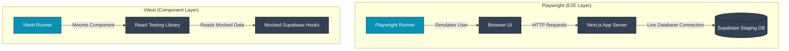

# SadamaAgent Test Architecture & Implementation Report

> [!NOTE]
> **Audience**: This document is designed for both Technical (Engineers/DevOps) and Non-Technical (Stakeholders/Product Managers) audiences. It outlines *how* our testing system works, *why* specific tools were chosen, and *what* guarantees it provides.

---

## 1. Executive Summary

As SadamaAgent transitions from an MVP to a production-ready marketplace, stability is critical. We have implemented an automated **Dual-Layer Testing Infrastructure**. 

This system acts as an automated QA team. Every time code is changed, the system:
1. Boots up the entire application.
2. Simulates real users clicking, typing, and navigating through the dashboard.
3. Tests individual UI components in isolation to ensure logic holds up under edge cases.
4. Generates a readable HTML report and JSON audit logs.

This ensures that bugs are caught *before* they reach live customers.

---

## 2. Toolchain Selection: Why We Chose This Stack

We evaluated several industry-standard tools before settling on our current stack. 

### End-to-End (E2E) Testing: **Playwright**
* **What it does**: Playwright launches a real browser (Chrome, Firefox, Safari) and interacts with the application exactly as a human would.
* **Why not Cypress?**: While Cypress is popular, it restricts tests to running inside the browser's execution loop. Playwright operates outside the browser, allowing us to interact with multiple tabs, intercept network requests perfectly, and handle native browser dialogs (like the "Are you sure you want to delete this berth?" prompt). It also runs significantly faster in parallel environments.

### Component Testing: **Vitest + React Testing Library**
* **What it does**: Tests isolated pieces of the UI (e.g., just the "Bookings Table") without launching a full browser or connecting to the real database.
* **Why not Jest?**: Our Next.js application relies heavily on modern JavaScript modules (ESM) and Turbopack. Jest struggles natively with ESM. Vitest is built specifically for modern, ultra-fast module bundlers. It executes our component tests in under 1 second.

---

## 3. System Architecture

Below is a visualization of how our tests interact with the SadamaAgent codebase and the Supabase database.



---

## 4. The Testing Pyramid Strategy

We structure our tests based on the "Testing Pyramid" philosophy:
1. **Component Tests (Base Layer)**: Fast, highly focused tests. We use these for UI elements like the `StatsCard` or `BookingsTable`. If data is passed in, does the correct color render?
2. **E2E Tests (Top Layer)**: Slower, but high-confidence tests. We use these for critical business flows like Logging In, Managing Berths, and Booking flows.

---

## 5. Code Review: How It Works Under The Hood

### The Page Object Model (POM) Design Pattern
To keep our E2E tests clean and maintainable, we use the **Page Object Model**. Instead of littering our tests with messy CSS selectors, we define the "Page" in one file, and the "Test" in another.

#### Example: The Berth Page Object (`tests/helpers/berths-page.ts`)
```typescript
export class BerthsPage extends BasePage {
  // We define the buttons once here.
  readonly addNewBerthButton: Locator

  constructor(page: Page) {
    super(page)
    this.addNewBerthButton = page.getByRole('button', { name: /add new/i })
  }

  // We abstract the complex action into a simple function.
  async deleteBerth(name: string) {
    const row = await this.getBerthRowByName(name)
    
    // Playwright automatically intercepts the browser's "Are you sure?" popup and accepts it!
    this.page.once('dialog', async dialog => await dialog.accept())
    
    // Click the trash icon
    await row.locator('.lucide-trash-2').click()
  }
}
```

#### Example: The Actual Test (`tests/e2e/berths.spec.ts`)
Because of the POM, our actual test reads like plain English. Even non-technical stakeholders can understand the test logic:

```typescript
test('should create, update, and delete a berth', async ({ page }) => {
    // 1. Create
    await berthsPage.clickAddNewBerth()
    await berthsPage.editBerth('New Berth', 'Test Berth', '75')
    
    // 2. Verify
    const newRow = await berthsPage.getBerthRowByName('Test Berth')
    await expect(newRow).toContainText('€75')

    // 3. Delete
    await berthsPage.deleteBerth('Test Berth')
})
```

---

### Component Isolation (Mocking the Database)
When testing the `BookingsTable` component, we do not want to wait for Supabase to return data. Instead, we "Mock" (fake) the database response.

```typescript
// We tell the test runner: "Whenever the app asks for bookings, give it this fake data instead."
vi.mock('@/lib/queries/bookings', () => ({
  useBookings: vi.fn().mockReturnValue({
    data: [
      { customerName: 'Captain Haddock', vessel: 'Sirius', status: 'confirmed' }
    ],
    isLoading: false
  })
}))

it('renders confirmed bookings with the correct status badge', () => {
  render(<BookingsTable />)
  // The test instantly passes, proving our UI logic is sound.
  expect(screen.getByText('Captain Haddock')).toBeDefined()
})
```

---

## 6. Reporting and Telemetry

> [!TIP]
> **Actionable Intelligence**
> A testing suite is only as good as its reports. If a test fails, you need to know exactly *why*.

1. **HTML Playwright Report**: When E2E tests run, an interactive HTML report is generated (`playwright-report/index.html`). It includes exact traces, network requests, and screenshots of the browser precisely when the failure occurred.
2. **Persistent JSON Logger**: We built a custom JSON logger (`tests/helpers/logger.ts`). Every action the tests take is logged with a timestamp into `tests/logs/`. This acts as an audit trail for CI/CD environments.

## 7. Next Steps & DevOps Readiness

The testing infrastructure is fully operational locally. The logical next phase is **DevOps Integration (CI/CD)**.
- **GitHub Actions / Vercel Pipeline**: We will configure the pipeline so that every time a developer pushes code, the CI server automatically boots up Supabase, runs the Playwright and Vitest suites, and blocks the deployment if any tests fail. 
- This guarantees a 0% regression rate for our critical paths moving forward into production!
